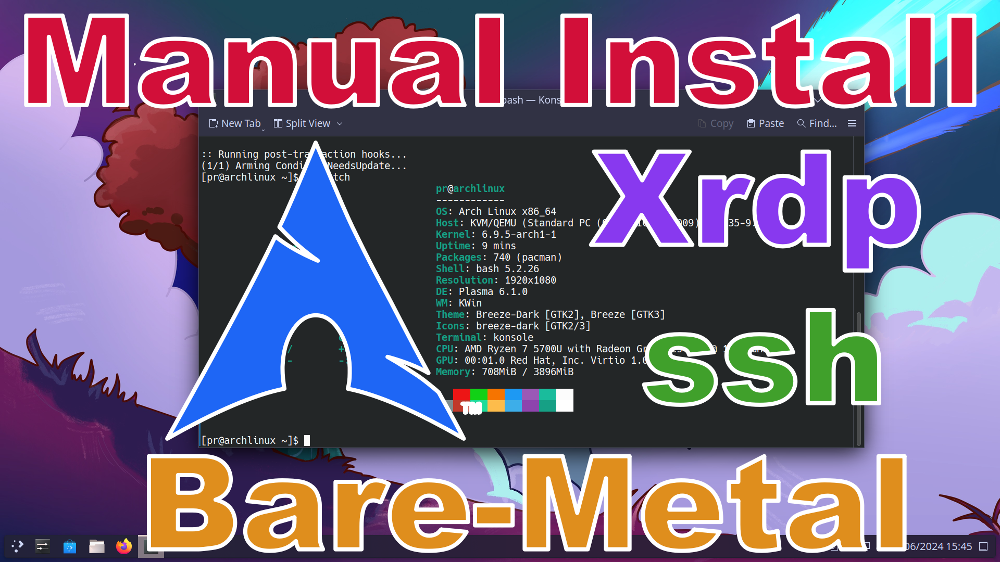

# Installing Archlinux on bare-metal manually.

https://wiki.archlinux.org/title/Installation_guide

## Create install USB stick.

Download the archlinux iso. \
https://archlinux.org/download/

To find the name of your USB device, use the command `lsblk`. \
The name of your USB. It will be `/dev/sdX` where sdX is the name of your USB device. 
Be careful it is not your hard drive or SSD. 
The partition `part /` is the device with your system partition. That is NOT the device you want to write to.
```
lsblk
```
Use the `dd` command to write the image to the USB. Change the directory to wherever you downloaded the file. Replace `/dev/sdX` with the name of your device.
```
cd ~/Downloads
dd bs=4M if=archlinux-x86_64.iso of=/dev/sdX conv=fsync oflag=direct status=progress
```
## Prepare host system.
You will need to boot your system from the USB drive. It may be something like pressing `Escape`, `F5`, `F8`, `F10` or `F11` during boot up.

If you are using a US keyboard you can skip this step. \
List available keymaps.
```
localectl list-keymaps | more
```
Here is an example of setting the UK keymap.
```
loadkeys uk
```
Set a password for the root user. SSH service is already running and accessable as root, but ssh a password set.
```
passwd
```
## Setup Wireless Connection (Optional)
If you have a wired connection, or using a VM, you are probably automatically online.

List Wifi adapter. For example `wlan0` and on the right `station`. This will be your DEVICE name.
```
iwctl device list
```
Scan Available Networks. Replcace DEVICE with your device name. The Network Name will be your SSID.
```
iwctl station DEVICE scan
```
Display the available SSID's.
```
iwctl station DEVICE get-networks
```
Connect Wifi to internet. Replace DEVICE and SSID below with their names. SSID needs to be in quotes. You will be prompted for a password to your SSID.
```
iwctl station DEVICE connect "SSID"
```
## Lets check if you're online.
```
ping archlinux.org
```
Get your IP address. For example 192.168.0.XXX.
```
ip a
```
## Connect the guest to the host system.
On the guest system log into the host using it's IP address and USERNAME. \
You will be asked to make a fingerprint then for the password
```
ssh USERNAME@IP
```
If there is already an existing fingerprint that needs to be removed.
```
ssh-keygen -R IP
```
## Create Partitions
WARNING!! This will permanently destroy some or all data on the device. \
Please for your own safety remove all unnesseary data storage devices. \
Please backup any data that is on the device you are about to partition that you do not wish to loose. \
Please check and double check that you are partitioning the correct device.

WARNING!! If you are Dual booting from the same device do not change the partition table type, \
do not change the EFI partition, do not change any partition needed for other systems. \
The only thing you can do is create a new root partition or optionally a new swap partition. \
Do not delete or change any other partition, you have been warned. \
Resizing a partition to make room is beyond the scope of these instructions.

List devices to find your target device.
```
lsblk
```
or
```
fdisk -l
```

WARNING!! Changing `Disklable type` will destroy all exisitng data on device. \
If your dual booting read the above warnings. If Dual booting read the warnings above agian. \
You can only add a root partition or swap into existing space and nothing else. You have been warned again!

Replace sdX with your desired device it may be for example "sda", "vda" or "nvme0n1".
```
fdisk /dev/sdX
```

Print the partition table with `p`. If you don't see "Disklable type: gpt" then press `g` to set it.

Create the EFI Boot partition with `n`. Accept all the defaults until "Last sector", input `+512M` or `+1G`.\
Set this partition type as "EFI System" with `t` then `1`.

Optionally Create a swap partition with `n`. Accept all the defaults until "Last sector" and input something like `+4G`.\
Set this partition type as "Linux Swap" with `t` and `19`.

Create the root partition with `n` and accept all the defaults to the end.

WARNING!! This is the point of no return. When you press `w` that acually writes the partition table. \
Quitting before this will not change the partition table.

Print the partition table again with `p`. If it all looks good you can write it with `w` and quit with `q`.
## Format Boot partition
If your device is /dev/sdX then partition 1 will be /dev/sdX1. \
It is your job to know which partition you are formating. I am just giving examples.

WARNING!! If you are dual booting do `NOT` format your EFI partition. \
Doing so will remove the existing data for your other operating systems. If you are dual booting skip this step.

Replace /dev/sdX1 with your EFI partition.
```
mkfs.fat -F32 /dev/sdX1
```
## Swap partition (Legacy)
Replace /dev/sdx2 with your swap partition.
```
mkswap /dev/sdX2
```
Mount optional swap partition (Legacy). Replace /dev/sdX2 with your swap partition.
```
swapon /dev/sdX2
```
## Create and mount EXT4 partition (Legacy)
I recommend using BTRFS not EXT4, however, there is instructions for both.

Format your system partition. Replace /dev/sdX3 with your system partition.
```
mkfs.ext4 /dev/sdX3
```
Mount root partition first to /mnt. Replace /dev/sdX3 with your root partition.
```
mount -o rw,noatime,discard,data=ordered /dev/sdX3 /mnt
```
## Create and mount BTRFS partitions (Recommended)
I recommend using BTRFS not EXT4, however, there is instructions for both.

Format your system partition. Replace /dev/sdX3 with your system partition.
```
mkfs.btrfs -f /dev/sdX3
```
Mount root partition first to /mnt. Replace /dev/sdX3 with your root partition.
```
mount /dev/sdX3 /mnt
```
Create subvolumes
```
btrfs subvolume create /mnt/@
btrfs subvolume create /mnt/@home
btrfs subvolume create /mnt/@log
btrfs subvolume create /mnt/@pkg
btrfs subvolume create /mnt/@.snapshots
```
Unmount root partition
```
umount /mnt
```
Mount root subvolume on /mnt. Replace /dev/sdX3 with your root partion.
```
mount -o ssd,discard=async,noatime,compress=zstd:3,space_cache=v2,autodefrag,subvol=@ /dev/sdX3 /mnt
```
Create needed directories in root for subvolume.
```
mkdir -p /mnt/{home,var/log,var/cache/pacman/pkg,.snapshots}
```
Mount the subvolumes. Replace /dev/sdX3 with the root partiton.
```
mount -o ssd,discard=async,noatime,compress=zstd:3,space_cache=v2,autodefrag,subvol=@home /dev/sdX3 /mnt/home
mount -o ssd,discard=async,noatime,compress=zstd:3,space_cache=v2,autodefrag,subvol=@log /dev/sdX3 /mnt/var/log
mount -o ssd,discard=async,noatime,compress=zstd:3,space_cache=v2,autodefrag,subvol=@pkg /dev/sdX3 /mnt/var/cache/pacman/pkg
mount -o ssd,discard=async,noatime,compress=zstd:3,space_cache=v2,autodefrag,subvol=@.snapshots /dev/sdX3 /mnt/.snapshots
```

## Mount boot partition, creating the directory if needed
Replace /dev/sdX1 with your EFI boot partition.
```
mkdir -p /mnt/boot
mount -t vfat -o rw,relatime,fmask=0022,dmask=0022,codepage=437,iocharset=ascii,shortname=mixed,utf8,errors=remount-ro /dev/sdX1 /mnt/boot
```
## Prepair Installation
Run reflector to get fastest servers.
```
reflector
```
Allow Parallel downloads for pacman.
```
sudo sed -i 's/^#Parall/Parall/' /etc/pacman.conf
```
Update available package list.
```
pacman -Syy
```
## Install KDE Plasma
Use pacstrap to install a full KDE Plasma system all at once.
```
pacstrap -K /mnt base linux linux-firmware \
base-devel btrfs-progs efibootmgr zram-generator \
htop iwd nano openssh smartmontools vim wget wireless_tools wpa_supplicant xdg-utils \
intel-media-driver libva-intel-driver libva-mesa-driver mesa vulkan-intel vulkan-radeon \
xf86-video-amdgpu xf86-video-ati xf86-video-nouveau xf86-video-vmware xorg-server xorg-xinit \
pipewire pipewire-alsa pipewire-jack pipewire-pulse gst-plugin-pipewire libpulse wireplumber \
ark dolphin egl-wayland konsole kate network-manager-applet plasma-meta plasma-workspace \
pacman-contrib libva-utils compsize mesa-demos firefox kde-applications-meta
```
Generate `/etc/fstab` for your new system.
```
genfstab -U /mnt >> /mnt/etc/fstab
```
Copy over systemd-network config files.
```
cp /etc/systemd/network/* /mnt/etc/systemd/network
```
## Configure system in chroot environment
Use arch-chroot to change roots into new system.
```
arch-chroot /mnt
```
Enable systemd-boot.
```
bootctl install
```
Create systemd-boot entry for Archlinux. `blkid -s PARTUUID -o value /dev/vda2` \
will be used to figure out the PARTUUID. Replace `/dev/vda2` with your root device.
```
echo "title Arch Linux (linux)
linux /vmlinuz-linux
initrd /initramfs-linux.img
options root=PARTUUID="$(blkid -s PARTUUID -o value /dev/vda2) "zswap.enabled=0 rootflags=subvol=@ rw rootfstype=btrfs" > /boot/loader/entries/archlinux.conf
```
Create a systemd-boot entry for Archlinux Fallback.
```
echo "title Arch Linux (linux-fallback)
linux /vmlinuz-linux
initrd /initramfs-linux-fallback.img
options root=PARTUUID="$(blkid -s PARTUUID -o value /dev/vda2) "zswap.enabled=0 rootflags=subvol=@ rw rootfstype=btrfs" > /boot/loader/entries/archlinux-fallback.conf
```
Enable systemd-boot loader timeout.
```
sed -i 's/^#time/time/' /boot/loader/loader.conf
```
Enable sudo with NOPASSWD for wheel group.
```
sed -i 's/^# %wheel ALL=(ALL:ALL) NOPASSWD/%wheel ALL=(ALL:ALL) NOPASSWD/' /etc/sudoers
```
Set zram to twice the size of ram.
```
echo "[zram0]" > /etc/systemd/zram-generator.conf
echo "compression-algorithm = zstd" >> /etc/systemd/zram-generator.conf
echo "zram-size = ram * 2" >> /etc/systemd/zram-generator.conf
```
Allow Parallel downloads for pacman.
```
sed -i 's/^#Parall/Parall/' /etc/pacman.conf
```
Create a root password
```
passwd
```
Create a new user. All users in the wheel group will get sudo privilege. Replace MYUSER below with your desired new user name.
```
useradd -m MYUSER -G wheel
```
Give your new user a password.
```
passwd MYUSER
```
Enable sshd
```
systemctl enable sshd
```
## Wireless setup (Option 1) Copy existing connection.
In order to reboot into the new install but also have it connect with the same IP address so that ssh keeps working we will disable NetworkManager and copy the existing settings over. This will let iwd automatically connect wihtout needing to login. But KDE will not show the network icon since NetworkManager is not running.

Enable iwd.
```
systemctl enable iwd
```
Enable systemd-networkd.
```
systemctl enable systemd-networkd
```
Enable systemd-resolved
```
systemctl enable systemd-resolved
```
Exit chroot.
```
exit
```
Create a simlink for systemd-resolved. Remove `/etc/resolv.conf` if you disable systemd-resolved later.
```
ln -sf ../run/systemd/resolve/stub-resolv.conf /mnt/etc/resolv.conf
```
Copy iwd login credentials.
```
cp -r /var/lib/iwd /mnt/var/lib
```
## Wireless setup (Option 2)
In KDE NetworkManager will connect to wifi when logged in. But we want wifi connected on bootup. Using nmcli we will set up a connection that will do this. This will mean NetworkManager is still runnning for KDE. But this will mean we need to Interact with the host system again to set this up. This can't be done remotely.

Enable NetworkManager.
```
systemctl enable NetworkManager
```
After rebooting the host system login and then connect to wifi with nmcli. Replace SSID with the SSID used above. You will be asked for sudo password then your SSID password.
```
sudo nmcli device wifi connect "SSID" --ask
```
If you get an error about "secrets were asked but not given", try removing the existing NetworkManager saved login.
```
sudo nmcli con del "SSID"
```
Get you IP address like above. It may have changed.
```
ip a
```
Exit chroot.
```
exit
```
## Finish configuring in new system.
Reboot into the new Arch Linux system.
```
reboot
```
List timezones.
```
sudo timedatectl list-timezones | more
```
Set your timezone. Replace Europe/London below with yours.
```
sudo timedatectl set-timezone Europe/London
```
Enable network time synchronization.
```
sudo timedatectl set-ntp true
```
Set hostname.
```
sudo hostnamectl hostname archlinux
```
Uncomment the locale you wish to generate.
```
sudo nano /etc/locale.gen
```
Generate locale.
```
sudo locale-gen
```
Set your locale with localectl. Replace en_GB.UTF-8 with your locale.
```
sudo localectl set-locale LANG=en_GB.UTF-8
```
List keyboard keymaps.
```
sudo localectl list-keymaps | more
```
Set keyboard keymap. Replace uk with your own keymap.
```
sudo localectl set-keymap uk
```
List of xll-keymap layouts.
```
sudo localectl list-x11-keymap-layouts | more
```
Set x11-keymap. Replace gb with your own x11-keymap.
```
sudo localectl set-x11-keymap gb
```
Set an x11-keymap for sddm. Replace gb with your choosen x11-keymap.
```
sudo bash -c "echo 'setxkbmap gb' >> /usr/share/sddm/scripts/Xsetup"
```
Change default cursor from Adwaita to breeze. This will fix sddm and other places.
```
sudo sed -i 's/Adwaita/breeze_cursors/' /usr/share/icons/default/index.theme
```
Enable bluetooth servie.
```
sudo systemctl enable bluetooth
```
## Enabling SDDM graphical login manager (Not Xrdp).
```
sudo systemctl enable sddm
```
## Reboot.
```
sudo reboot
```
## Setting up xrdp (Optional Xrdp)
Install needed packages to build xrdp xorgxrdp and pipewire-module-xrdp.
```
cd
sudo pacman -S --needed git fuse imlib2 nasm cmocka check xorg-server-devel
```
Build and install xrdp packages from aur.
```
cd
git clone https://aur.archlinux.org/xrdp.git
cd ~/xrdp
makepkg -i
```
Build and install xorgxrdp from aur.
```
cd
git clone https://aur.archlinux.org/xorgxrdp.git
cd ~/xorgxrdp
makepkg -i --skippgpcheck
```
Build and install pipewire-module-xrdp from aur.
```
cd
git clone https://aur.archlinux.org/pipewire-module-xrdp.git
cd ~/pipewire-module-xrdp
makepkg -i
```
Create an ~/.xinitrc so startx or xrdp will launch kde.
```
echo "export DESKTOP_SESSION=plasma" > ~/.xinitrc
echo "exec startplasma-x11" >> ~/.xinitrc
```
Enable xrdp service.
```
sudo systemctl enable xrdp
sudo systemctl start xrdp
```
On Guest system install freerdp.
```
sudo pacman -S --needed freerdp
```
List available xfreerdp key layouts. LAYOUT will be a hex number.
```
xfreerdp3 /list:kbd
```
Check virt-manager for the IP address of the archlinux vm. USERNAME and PASSWD will be the ones you created for this VM.
```
xfreerdp3 /u:USERNAME /p:PASSWD /w:1366 /h:768 /v:IP /video /sound /rfx /network:lan /gfx /dynamic-resolution /bpp:32 /kbd:layout:LAYOUT
```
## Configure Archlinux
### Make firefox usable. Add extensions.
Ublock Origin \
Sponsor Block \
I still don't care about cookies

### In firefox about:config set
media.av1.enable False \
network.trr.default_provider_uri https://94.140.14.14/dns-query \
network.trr.mode 3

## Add Catppuccin color schemes for breeze.
Git color schemes from this repo. There are 3 dark and 1 light.
```
cd
git clone https://github.com/programmingrainbow/Archlinux
cd Archlinux
```
Create a local/share folder if needed and copy the color-schemes folder there.
```
mkdir -p ~/.local/share
cp -r color-schemes ~/.local/share
```
Set global theme to Breeze Dark or Breeze Light. Then in colors set one of the corresponding catppuccin color schemes.

## Switch from iwd to NetworkManager.
Enable NetworkManager.
```
sudo systemctl enable NetworkManager
```
Disable iwd.
```
sudo systemctl disable iwd
```
Disable systemd-networkd.
```
sudo systemctl disable systemd-networkd
```
Disable systemd-resolved.
```
sudo systemctl disable systemd-resolved
```
Remove `/etc/resolv.conf`
```
sudo rm /etc/resolv.conf
```
Reboot into NetworkManager enabled system.
```
sudo reboot
```
## Use these mount points if repairing an install from iso.
You will need to change the `/dev/sda2` to the device you have btrfs installed to. Change `/dev/sda1` to your boot device.
```
mount -o ssd,discard=async,noatime,compress=zstd:3,space_cache=v2,autodefrag,subvol=@ /dev/sda2 /mnt
mount -o ssd,discard=async,noatime,compress=zstd:3,space_cache=v2,autodefrag,subvol=@home /dev/sda2 /mnt/home
mount -o ssd,discard=async,noatime,compress=zstd:3,space_cache=v2,autodefrag,subvol=@log /dev/sda2 /mnt/var/log
mount -o ssd,discard=async,noatime,compress=zstd:3,space_cache=v2,autodefrag,subvol=@pkg /dev/sda2 /mnt/var/cache/pacman/pkg
mount -o ssd,discard=async,noatime,compress=zstd:3,space_cache=v2,autodefrag,subvol=@.snapshots /dev/sda2 /mnt/.snapshots
mount -t vfat -o rw,relatime,fmask=0022,dmask=0022,codepage=437,iocharset=ascii,shortname=mixed,utf8,errors=remount-ro /dev/sda1 /mnt/boot
```
