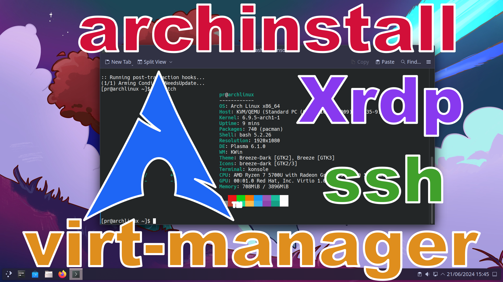

# Installing Archlinux in virt-manager with archinstall

https://wiki.archlinux.org/title/Installation_guide

## Setting up virt-manager

Download the archlinux iso. \
https://archlinux.org/download/

Install virt-manager.
```
sudo pacman -S --needed virt-manager virt-viewer qemu-desktop dnsmasq
```
Add youself to the the libvirt group.
```
sudo usermod -aG libvirt USERNAME
```
Enable and Start libvirtd service.
```
sudo systemctl enable libvirtd
sudo systemctl start libvirtd
```
Open virt-manager. Under Edit->Preferences->General check Enable XML Editing. \
If you do not see QEMU/KVM written in the center window go to File->Add Connection->Hypervisor select QEMU/KVM, check autoconnect and then click connect.

## Create the Archlinux VM.
Create a qemu image of at least 15G. This is optional or space saving. You can just create this in virt-manager later.
```
cd /var/lib/libvirt/images
sudo qemu-img create -f qcow2 archlinux.qcow2 15G
```

In virt-manager Create a new VM with atleast 4G of ram and select the image created above.

In virt-manager set Display Spice -> Listen type to None. Check OpenGL and select your GPU.

In virt-manager set Video -> Mode to Virtio for virGL and check 3D acceleration, or QXL for llvmpipe. \
If nothing else this shows how to add a default resolution. Pay attention if `<model>` ends like this `/>` or like this `</model>`. The first version is for single line. Simply remove the `/` and add the `</model>` to the line after the resolution line.
```
  <model type="virtio" heads="1" primary="yes">
    <acceleration accel3d="yes"/>
    <resolution x="1920" y="1080"/>
  </model>
```
or
```
  <model type="qxl" ram="65536" vram="65536" vgamem="16384" heads="1" primary="yes">
    <resolution x="1920" y="1080"/>
  </model>
```

Make sure virt-manager is using efi not mbr. This is so we can use systemd-boot \
There is an option when first creating the VM `Customize configuration before Install` that will give you the option to change BIOS to UEFI. If you miss this step you will need to find these lines in the XML.
```
  <os>
    <type arch="x86_64" machine="pc-q35-9.0">hvm</type>
    <boot dev="hd"/>
  </os>
```
Replace them With these lines.
```
  <os firmware="efi">
    <type arch="x86_64" machine="pc-q35-9.0">hvm</type>
    <firmware>
      <feature enabled="no" name="enrolled-keys"/>
      <feature enabled="yes" name="secure-boot"/>
    </firmware>
    <loader readonly="yes" secure="yes" type="pflash">/usr/share/edk2/x64/OVMF_CODE.secboot.4m.fd</loader>
    <nvram template="/usr/share/edk2/x64/OVMF_VARS.4m.fd">/var/lib/libvirt/qemu/nvram/archlinux_VARS.fd</nvram>
  </os>
```

Boot VM with ISO mounted.

## Login to host system with ssh.
Set a password for the root user. SSH service is already running and accessable as root, but ssh a password set.
```
passwd
```
Get your IP address. For example 192.168.0.XXX.
```
ip a
```
On the guest system log into the host using it's IP address and root. \
You will be asked to make a fingerprint then for the password
```
ssh root@IP
```
If there is already an existing fingerprint that needs to be removed.
```
ssh-keygen -R IP
```
## Install Archlinux.
List available keyboard layouts.
```
localectl list-keymaps
```
Set keyboard layout.
```
loadkeys uk
```
Run reflector to get fastest servers.
```
reflector
```
Allow Parallel downloads for pacman.
```
sudo sed -i 's/^#Parall/Parall/' /etc/pacman.conf
```
Update available package list.
```
pacman -Syy
```
Install Archlinux with btrfs and compression, systemd-boot, kde desktop and pipewire.
```
archinstall
```
Accept the chroot into the new system.

Enable sudo with NOPASSWD for wheel group.
```
sed -i 's/^# %wheel ALL=(ALL:ALL) NOPASSWD/%wheel ALL=(ALL:ALL) NOPASSWD/' /etc/sudoers
```
Remove user specific config. Replace USERNAME with your username.
```
rm /etc/sudoers.d/00_*
```
Set zram to twice the size of ram.
```
echo "[zram0]" > /etc/systemd/zram-generator.conf
echo "compression-algorithm = zstd" >> /etc/systemd/zram-generator.conf
echo "zram-size = ram * 2" >> /etc/systemd/zram-generator.conf
```
Allow Parallel downloads for pacman.
```
sed -i 's/^#Parall/Parall/' /etc/pacman.conf
```

Dismount install ISO and reboot.

## Configuring KDE Plasma
Install extra packages including firefox.
```
sudo pacman -S --needed pacman-contrib libva-utils mesa-demos compsize firefox
```
If you want a full featured KDE install add kde-applications.
```
sudo pacman -S --needed kde-applications-meta
```
### Make firefox usable. Add extensions.
Ublock Origin \
Sponsor Block \
I still don't care about cookies

### In firefox about:config set
media.av1.enable False \
network.trr.default_provider_uri https://94.140.14.14/dns-query \
network.trr.mode 3

Change default cursor from Adwaita to breeze. This will fix sddm and other places.
```
sudo sed -i 's/Adwaita/breeze_cursors/' /usr/share/icons/default/index.theme
```
Set a default keyboard for sddm if you don't want to see it set to US by default. \
Get a list of available x11-keymaps.
```
localectl list-x11-keymap-layouts
```
Set an x11-keymap for sddm. Replace gb with your choosen x11-keymap.
```
sudo bash -c "echo 'setxkbmap gb' >> /usr/share/sddm/scripts/Xsetup"
```
## Setting up xrdp
Install needed packages to build xrdp xorgxrdp and pipewire-module-xrdp.
```
cd
sudo pacman -S --needed git fuse imlib2 nasm cmocka check xorg-server-devel
```
Build and install xrdp packages from aur.
```
cd
git clone https://aur.archlinux.org/xrdp.git
cd ~/xrdp
makepkg -i
```
Build and install xorgxrdp from aur.
```
cd
git clone https://aur.archlinux.org/xorgxrdp.git
cd ~/xorgxrdp
makepkg -i --skippgpcheck
```
Build and install pipewire-module-xrdp from aur.
```
cd
git clone https://aur.archlinux.org/pipewire-module-xrdp.git
cd ~/pipewire-module-xrdp
makepkg -i
```
Create an ~/.xinitrc so startx or xrdp will launch kde.
```
echo "export DESKTOP_SESSION=plasma" > ~/.xinitrc
echo "exec startplasma-x11" >> ~/.xinitrc
```
Enable xrdp service.
```
sudo systemctl enable xrdp
sudo systemctl start xrdp
```
Disable sddm service.
```
sudo systemctl disable sddm
sudo systemctl stop sddm
```
Reboot the VM.

On Guest system install freerdp.
```
sudo pacman -S --needed freerdp
```
List available xfreerdp key layouts. LAYOUT will be a hex number.
```
xfreerdp3 /list:kbd
```
Check virt-manager for the IP address of the archlinux vm. USERNAME and PASSWD will be the ones you created for this VM.
```
xfreerdp3 /u:USERNAME /p:PASSWD /w:1366 /h:768 /v:IP /video /sound /rfx /network:lan /gfx /dynamic-resolution /bpp:32 /kbd:layout:LAYOUT
```
## Setting up ssh
On the host system enable sshd.
```
sudo systemctl enable sshd
sudo systemctl start sshd
```
On the guest system log into the host using it's IP address and USERNAME. \
You will be asked to make a fingerprint then for the password
```
ssh USERNAME@IP
```
If there is already an existing fingerprint that needs to be removed.
```
ssh-keygen -R IP
```
## Add Catppuccin color schemes for breeze.
Git color schemes from this repo. There are 3 dark and 1 light.
```
cd
git clone https://github.com/programmingrainbow/Archlinux
cd Archlinux
```
Create a local/share folder if needed and copy the color-schemes folder there.
```
mkdir -p ~/.local/share
cp -r color-schemes ~/.local/share
```
Set global theme to Breeze Dark or Breeze Light. Then in colors set one of the corresponding catppuccin color schemes.
## Use these mount points if repairing an install from iso.
You will need to change the `/dev/vda2` to the device you have btrfs installed to. Change `/dev/vda1` to your boot device.
```
mount -o ssd,discard=async,noatime,compress=zstd:3,space_cache=v2,autodefrag,subvol=@ /dev/vda2 /mnt
mount -o ssd,discard=async,noatime,compress=zstd:3,space_cache=v2,autodefrag,subvol=@home /dev/vda2 /mnt/home
mount -o ssd,discard=async,noatime,compress=zstd:3,space_cache=v2,autodefrag,subvol=@log /dev/vda2 /mnt/var/log
mount -o ssd,discard=async,noatime,compress=zstd:3,space_cache=v2,autodefrag,subvol=@pkg /dev/vda2 /mnt/var/cache/pacman/pkg
mount -o ssd,discard=async,noatime,compress=zstd:3,space_cache=v2,autodefrag,subvol=@.snapshots /dev/vda2 /mnt/.snapshots
mount -t vfat -o rw,relatime,fmask=0022,dmask=0022,codepage=437,iocharset=ascii,shortname=mixed,utf8,errors=remount-ro /dev/vda1 /mnt/boot
```
