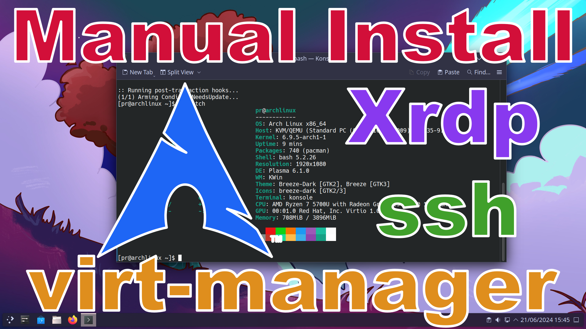

# Installing Archlinux in virt-manager manually.

https://wiki.archlinux.org/title/Installation_guide

## Setting up virt-manager

Download the archlinux iso. \
https://archlinux.org/download/

Install virt-manager.
```
sudo pacman -S --needed virt-manager virt-viewer qemu-desktop dnsmasq
```
Add youself to the the libvirt group.
```
sudo usermod -aG libvirt USERNAME
```
Enable and Start libvirtd service.
```
sudo systemctl enable libvirtd
sudo systemctl start libvirtd
```
Open virt-manager. Under Edit->Preferences->General check Enable XML Editing. \
If you do not see QEMU/KVM written in the center window go to File->Add Connection->Hypervisor select QEMU/KVM, check autoconnect and then click connect.

## Create the Archlinux VM.
Create a qemu image of at least 15G. This is optional or space saving. You can just create this in virt-manager later.
```
cd /var/lib/libvirt/images
sudo qemu-img create -f qcow2 archlinux.qcow2 15G
```

In virt-manager Create a new VM with atleast 4G of ram and select the image created above.

In virt-manager set Display Spice -> Listen type to None. Check OpenGL and select your GPU.

In virt-manager set Video -> Mode to Virtio for virGL and check 3D acceleration, or QXL for llvmpipe. \
If nothing else this shows how to add a default resolution. Pay attention if `<model>` ends like this `/>` or like this `</model>`. The first version is for single line. Simply remove the `/` and add the `</model>` to the line after the resolution line.
```
  <model type="virtio" heads="1" primary="yes">
    <acceleration accel3d="yes"/>
    <resolution x="1920" y="1080"/>
  </model>
```
or
```
  <model type="qxl" ram="65536" vram="65536" vgamem="16384" heads="1" primary="yes">
    <resolution x="1920" y="1080"/>
  </model>
```

Make sure virt-manager is using efi not mbr. This is so we can use systemd-boot \
There is an option when first creating the VM `Customize configuration before Install` that will give you the option to change BIOS to UEFI. If you miss this step you will need to find these lines in the XML.
```
  <os>
    <type arch="x86_64" machine="pc-q35-9.0">hvm</type>
    <boot dev="hd"/>
  </os>
```
Replace them With these lines.
```
  <os firmware="efi">
    <type arch="x86_64" machine="pc-q35-9.0">hvm</type>
    <firmware>
      <feature enabled="no" name="enrolled-keys"/>
      <feature enabled="yes" name="secure-boot"/>
    </firmware>
    <loader readonly="yes" secure="yes" type="pflash">/usr/share/edk2/x64/OVMF_CODE.secboot.4m.fd</loader>
    <nvram template="/usr/share/edk2/x64/OVMF_VARS.4m.fd">/var/lib/libvirt/qemu/nvram/archlinux_VARS.fd</nvram>
  </os>
```

Boot VM with ISO mounted.

## Set keyboard layout.
```
localectl list-keymaps
```
Set keyboard layout.
```
loadkeys uk
```
## Login to host system with ssh.
Set a password for the root user. SSH service is already running and accessable as root, but ssh a password set.
```
passwd
```
Get your IP address. For example 192.168.0.XXX.
```
ip a
```
On the guest system log into the host using it's IP address and root. \
You will be asked to make a fingerprint then for the password
```
ssh root@IP
```
If there is already an existing fingerprint that needs to be removed.
```
ssh-keygen -R IP
```
## Create Partitions
WARNING!! This will permanently destroy some or all data on the device. \
Please for your own safety remove all unnesseary data storage devices. \
Please backup any data that is on the device you are about to partition that you do not wish to loose. \
Please check and double check that you are partitioning the correct device.

WARNING!! If you are Dual booting from the same device do not change the partition table type, \
do not change the EFI partition, do not change any partition needed for other systems. \
The only thing you can do is create a new root partition or optionally a new swap partition. \
Do not delete or change any other partition, you have been warned. \
Resizing a partition to make room is beyond the scope of these instructions.

List devices to find your target device.
```
lsblk
```
or
```
fdisk -l
```

WARNING!! Changing `Disklable type` will destroy all exisitng data on device. \
If your dual booting read the above warnings. If Dual booting read the warnings above agian. \
You can only add a root partition or swap into existing space and nothing else. You have been warned again!

Replace sdX with your desired device it may be for example "sda", "vda" or "nvme0n1".
```
fdisk /dev/sdX
```

Print the partition table with `p`. If you don't see "Disklable type: gpt" then press `g` to set it.

Create the EFI Boot partition with `n`. Accept all the defaults until "Last sector", input `+512M` or `+1G`.\
Set this partition type as "EFI System" with `t` then `1`.

Optionally Create a swap partition with `n`. Accept all the defaults until "Last sector" and input something like `+4G`.\
Set this partition type as "Linux Swap" with `t` and `19`.

Create the root partition with `n` and accept all the defaults to the end.

WARNING!! This is the point of no return. When you press `w` that acually writes the partition table. \
Quitting before this will not change the partition table.

Print the partition table again with `p`. If it all looks good you can write it with `w` and quit with `q`.
## Format Boot partition
If your device is /dev/sdX then partition 1 will be /dev/sdX1. \
It is your job to know which partition you are formating. I am just giving examples.

WARNING!! If you are dual booting do `NOT` format your EFI partition. \
Doing so will remove the existing data for your other operating systems. If you are dual booting skip this step.

Replace /dev/sdX1 with your EFI partition.
```
mkfs.fat -F32 /dev/sdX1
```
## Swap partition (Legacy)
Replace /dev/sdx2 with your swap partition.
```
mkswap /dev/sdX2
```
Mount optional swap partition (Legacy). Replace /dev/sdX2 with your swap partition.
```
swapon /dev/sdX2
```
## Create and mount EXT4 partition (Legacy)
I recommend using BTRFS not EXT4, however, there is instructions for both.

Format your system partition. Replace /dev/sdX3 with your system partition.
```
mkfs.ext4 /dev/sdX3
```
Mount root partition first to /mnt. Replace /dev/sdX3 with your root partition.
```
mount -o rw,noatime,discard,data=ordered /dev/sdX3 /mnt
```
## Create and mount BTRFS partitions (Recommended)
I recommend using BTRFS not EXT4, however, there is instructions for both.

Format your system partition. Replace /dev/sdX3 with your system partition.
```
mkfs.btrfs /dev/sdX3
```
Mount root partition first to /mnt. Replace /dev/sdX3 with your root partition.
```
mount /dev/sdX3 /mnt
```
Create subvolumes
```
btrfs subvolume create /mnt/@
btrfs subvolume create /mnt/@home
btrfs subvolume create /mnt/@log
btrfs subvolume create /mnt/@pkg
btrfs subvolume create /mnt/@.snapshots
```
Unmount root partition
```
umount /mnt
```
Mount root subvolume on /mnt. Replace /dev/sdX3 with your root partion.
```
mount -o ssd,discard=async,noatime,compress=zstd:3,space_cache=v2,autodefrag,subvol=@ /dev/sdX3 /mnt
```
Create needed directories in root for subvolume.
```
mkdir -p /mnt/{home,var/log,var/cache/pacman/pkg,.snapshots}
```
Mount the subvolumes. Replace /dev/sdX3 with the root partiton.
```
mount -o ssd,discard=async,noatime,compress=zstd:3,space_cache=v2,autodefrag,subvol=@home /dev/sdX3 /mnt/home
mount -o ssd,discard=async,noatime,compress=zstd:3,space_cache=v2,autodefrag,subvol=@log /dev/sdX3 /mnt/var/log
mount -o ssd,discard=async,noatime,compress=zstd:3,space_cache=v2,autodefrag,subvol=@pkg /dev/sdX3 /mnt/var/cache/pacman/pkg
mount -o ssd,discard=async,noatime,compress=zstd:3,space_cache=v2,autodefrag,subvol=@.snapshots /dev/sdX3 /mnt/.snapshots
```

## Mount boot partition, creating the directory if needed
Replace /dev/sdX1 with your EFI boot partition.
```
mkdir -p /mnt/boot
mount -t vfat -o rw,relatime,fmask=0022,dmask=0022,codepage=437,iocharset=ascii,shortname=mixed,utf8,errors=remount-ro /dev/sdX1 /mnt/boot
```
## Prepair Installation
Run reflector to get fastest servers.
```
reflector
```
Allow Parallel downloads for pacman.
```
sudo sed -i 's/^#Parall/Parall/' /etc/pacman.conf
```
Update available package list.
```
pacman -Syy
```
## Install KDE Plasma
Use pacstrap to install a full KDE Plasma system all at once.
```
pacstrap -K /mnt base linux linux-firmware \
base-devel btrfs-progs efibootmgr zram-generator \
htop iwd nano openssh smartmontools vim wget wireless_tools wpa_supplicant xdg-utils \
intel-media-driver libva-intel-driver libva-mesa-driver mesa vulkan-intel vulkan-radeon \
xf86-video-amdgpu xf86-video-ati xf86-video-nouveau xf86-video-vmware xorg-server xorg-xinit \
pipewire pipewire-alsa pipewire-jack pipewire-pulse gst-plugin-pipewire libpulse wireplumber \
ark dolphin egl-wayland konsole kate network-manager-applet plasma-meta plasma-workspace \
pacman-contrib libva-utils comsize mesa-demos firefox kde-applications-meta
```
Generate `/etc/fstab` for your new system.
```
genfstab -U /mnt >> /mnt/etc/fstab
```
Copy over systemd-network config files.
```
cp /etc/systemd/network/* /mnt/etc/systemd/network
```
## Configure system in chroot environment
Use arch-chroot to change roots into new system.
```
arch-chroot /mnt
```
Enable systemd-boot.
```
bootctl install
```
Create systemd-boot entry for Archlinux. `blkid -s PARTUUID -o value /dev/vda2` \
will be used to figure out the PARTUUID. Replace `/dev/vda2` with your root device.
```
echo "title Arch Linux (linux)
linux /vmlinuz-linux
initrd /initramfs-linux.img
options root=PARTUUID="$(blkid -s PARTUUID -o value /dev/vda2) "zswap.enabled=0 rootflags=subvol=@ rw rootfstype=btrfs" > /boot/loader/entries/archlinux.conf
```
Create a systemd-boot entry for Archlinux Fallback.
```
echo "title Arch Linux (linux-fallback)
linux /vmlinuz-linux
initrd /initramfs-linux-fallback.img
options root=PARTUUID="$(blkid -s PARTUUID -o value /dev/vda2) "zswap.enabled=0 rootflags=subvol=@ rw rootfstype=btrfs" > /boot/loader/entries/archlinux-fallback.conf
```
Enable sudo with NOPASSWD for wheel group.
```
sed -i 's/^# %wheel ALL=(ALL:ALL) NOPASSWD/%wheel ALL=(ALL:ALL) NOPASSWD/' /etc/sudoers
```
Set zram to twice the size of ram.
```
echo "compression-algorithm = zstd" >> /etc/systemd/zram-generator.conf
echo "zram-size = ram * 2" >> /etc/systemd/zram-generator.conf
```
Allow Parallel downloads for pacman.
```
sed -i 's/^#Parall/Parall/' /etc/pacman.conf
```


Create a root password
```
passwd
```
Create a new user. All users in the wheel group will get sudo privilege. Replace MYUSER below with your desired new user name.
```
useradd -m MYUSER -G wheel
```
Give your new user a password.
```
passwd MYUSER
```


### Boot into new Arch Linux
We need to exit the chroot environment.

    # exit

Now we need to reboot into the new Arch Linux system. Be sure to remove the USB at shutdown and let it boot into the new system.

    # reboot


List timezones.
```
timedatectl list-timezones
```
Set your timezone. Replace Europe/London below with yours.
```
timedatectl set-timezone Europe/London
```
Enable network time synchronization.
```
timedatectl set-ntp true
```


Uncomment the locale you wish to generate.
```
nano /etc/locale.gen
```
Generate locale.
```
sudo locale-gen
```
Set your locale with localectl. Replace en_GB.UTF-8 with your locale.
```
localectl set-locale LANG=en_GB.UTF-8
```

List keyboard keymaps.
```
localectl list-keymaps
```
Set keyboard keymap. Replace uk with your own keymap.
```
localectl set-keymap uk
```
List of xll-keymap layouts.
```
localectl list-x11-keymap-layouts
```
Set x11-keymap. Replace gb with your own x11-keymap.
```
localectl set-x11-keymap gb
```


Change default cursor from Adwaita to breeze. This will fix sddm and other places.
```
sudo sed -i 's/Adwaita/breeze_cursors/' /usr/share/icons/default/index.theme
```
Set a default keyboard for sddm if you don't want to see it set to US by default. \
Get a list of available x11-keymaps.
```
localectl list-x11-keymap-layouts
```
Set an x11-keymap for sddm. Replace gb with your choosen x11-keymap.
```
sudo bash -c "echo 'setxkbmap gb' >> /usr/share/sddm/scripts/Xsetup"
```


### Enable required services
Enabling system services will start them during the next boot.
We need to enable Network Manager to user the internet.

    # systemctl enable NetworkManager

Enable bluetooth servie.

    # systemctl enable bluetooth

Enabling SDDM will make the system boot to the graphical login manager for KDE.

    # systemctl enable sddm

### Reboot
Now it is time to reboot into your new Arch Linux system.

    # reboot


Dismount install ISO and reboot.


```
### Make firefox usable. Add extensions.
Ublock Origin \
Sponsor Block \
I still don't care about cookies

### In firefox about:config set
media.av1.enable False \
network.trr.default_provider_uri https://94.140.14.14/dns-query \
network.trr.mode 3

## Setting up xrdp
Install needed packages to build xrdp xorgxrdp and pipewire-module-xrdp.
```
cd
sudo pacman -S --needed git fuse imlib2 nasm cmocka check xorg-server-devel
```
Build and install xrdp packages from aur.
```
cd
git clone https://aur.archlinux.org/xrdp.git
cd ~/xrdp
makepkg -i
```
Build and install xorgxrdp from aur.
```
cd
git clone https://aur.archlinux.org/xorgxrdp.git
cd ~/xorgxrdp
makepkg -i --skippgpcheck
```
Build and install pipewire-module-xrdp from aur.
```
cd
git clone https://aur.archlinux.org/pipewire-module-xrdp.git
cd ~/pipewire-module-xrdp
makepkg -i
```
Create an ~/.xinitrc so startx or xrdp will launch kde.
```
echo "export DESKTOP_SESSION=plasma" > ~/.xinitrc
echo "exec startplasma-x11" >> ~/.xinitrc
```
Enable xrdp service.
```
sudo systemctl enable xrdp
sudo systemctl start xrdp
```
Disable sddm service.
```
sudo systemctl disable sddm
sudo systemctl stop sddm
```
Reboot the VM.

On Guest system install freerdp.
```
sudo pacman -S --needed freerdp
```
List available xfreerdp key layouts. LAYOUT will be a hex number.
```
xfreerdp3 /list:kbd
```
Check virt-manager for the IP address of the archlinux vm. USERNAME and PASSWD will be the ones you created for this VM.
```
xfreerdp3 /u:USERNAME /p:PASSWD /w:1366 /h:768 /v:IP /video /sound /rfx /network:lan /gfx /dynamic-resolution /bpp:32 /kbd:layout:LAYOUT
```
## Setting up ssh
On the host system enable sshd.
```
sudo systemctl enable sshd
sudo systemctl start sshd
```
On the guest system log into the host using it's IP address and USERNAME. \
You will be asked to make a fingerprint then for the password
```
ssh USERNAME@IP
```
If there is already an existing fingerprint that needs to be removed.
```
ssh-keygen -R IP
```
## Add Catppuccin color schemes for breeze.
Git color schemes from this repo. There are 3 dark and 1 light.
```
cd
git clone https://github.com/programmingrainbow/Archlinux
cd Archlinux
```
Create a local/share folder if needed and copy the color-schemes folder there.
```
mkdir -p ~/.local/share
cp -r color-schemes ~/.local/share
```
Set global theme to Breeze Dark or Breeze Light. Then in colors set one of the corresponding catppuccin color schemes.
## Use these mount points if repairing an install from iso.
You will need to change the `/dev/vda2` to the device you have btrfs installed to. Change `/dev/vda1` to your boot device.
```
mount -o ssd,discard=async,noatime,compress=zstd:3,space_cache=v2,autodefrag,subvol=@ /dev/vda2 /mnt
mount -o ssd,discard=async,noatime,compress=zstd:3,space_cache=v2,autodefrag,subvol=@home /dev/vda2 /mnt/home
mount -o ssd,discard=async,noatime,compress=zstd:3,space_cache=v2,autodefrag,subvol=@log /dev/vda2 /mnt/var/log
mount -o ssd,discard=async,noatime,compress=zstd:3,space_cache=v2,autodefrag,subvol=@pkg /dev/vda2 /mnt/var/cache/pacman/pkg
mount -o ssd,discard=async,noatime,compress=zstd:3,space_cache=v2,autodefrag,subvol=@.snapshots /dev/vda2 /mnt/.snapshots
mount -t vfat -o rw,relatime,fmask=0022,dmask=0022,codepage=437,iocharset=ascii,shortname=mixed,utf8,errors=remount-ro /dev/vda1 /mnt/boot
```
